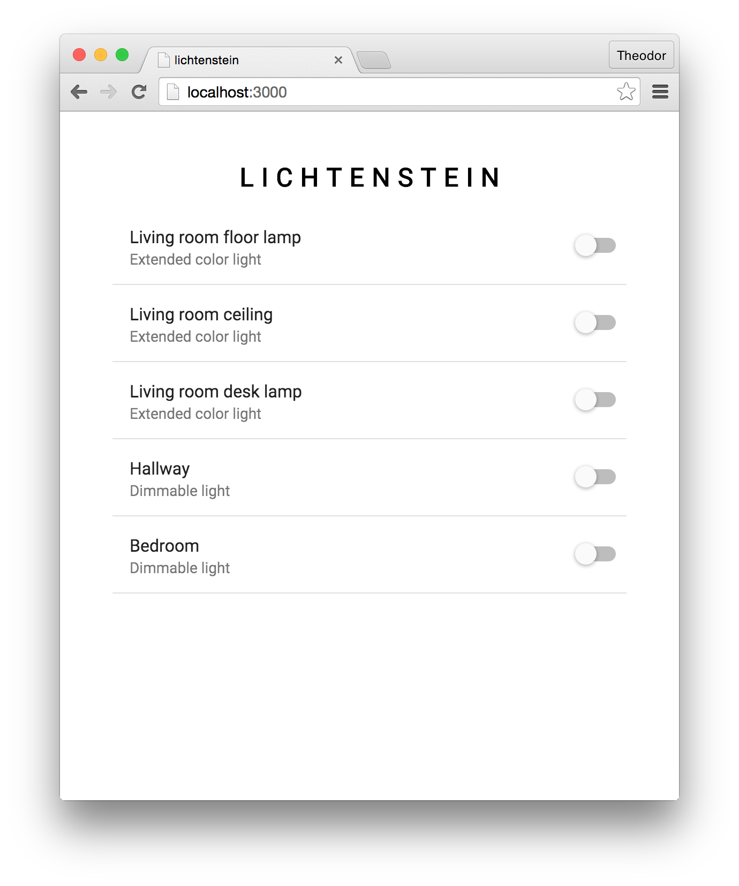

Lichtenstein
===

  

Lichtenstein is an app I've quickly cobbled together to remotely control the lightbulbs in my flat.

TODO
===

- Deploy it on its own server (RasPi?) so it doesn't need my laptop to be on to work.

Licensestein
===

[MIT](license.txt).
